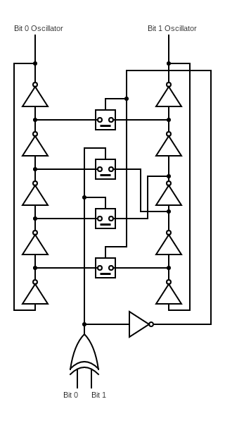
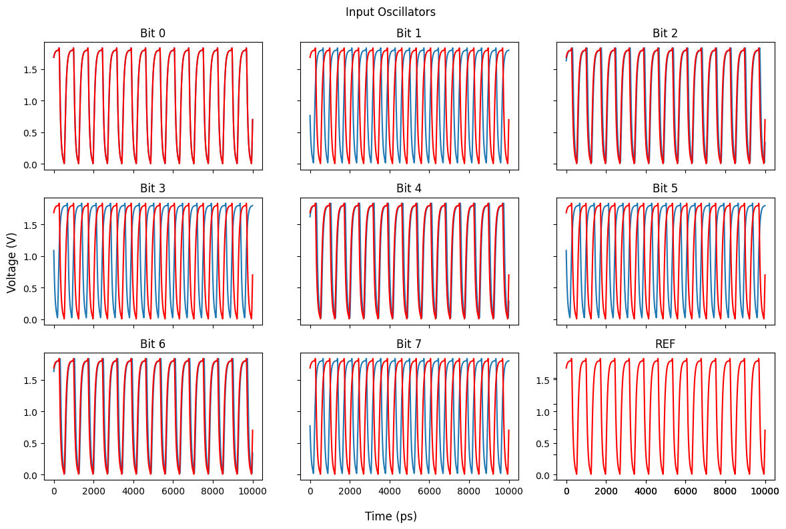

  

# TT04: Oscillator-Based Ising Multiplier

This repository contains:

- [ ] Unit Simulations of Individual Gates in HDL21
- [ ] Integration Simulations of the Multiplier in HDL21
- [ ] Complete Implementation in Verilog for OpenROAD Layout
- [ ] Special GDS Post-Processing + Simulation for this Design
- [ ] The Final Layout

### Theory

Oscillator-Based Ising Machines combine Ising Machines with the inhomogeneous Kuramoto model of systems of oscillators with weights.

The Ising Machine is defined by the Hamiltonian:

$$H = -\sum_{i,j} J_{ij} s_i s_j$$

where si is the spin of particle i. The probability of the system being in a particular state is given by the Boltzmann distribution:

$$P(s) = \frac{1}{Z} e^{-\beta H}$$

where $Z$ is the partition function and $\beta$ is the inverse temperature. So, the most likely state is the one with the lowest energy.

Using these facts, we can start designing $J$ using Linear Programming as I've detailed extensively in my [p-computing repository](https://github.com/ThomasPluck/p-computing).

However, this is a pretty mathematical machine, not a tangible engineering concept - so how exactly do we implement this in hardware? The answer is that we rely on the inhomogeneous Kuramoto model on a system of oscillators, this is defined by the differential equation:

$$\dot{\theta_i} = - \sum_{i\neq j} K_{ij} \sin(\theta_j - \theta_i)$$

assuming oscillators have neglible difference in natural frequency, where $\theta_i$ is the phase of oscillator $i$, $\omega_i$ is the natural frequency of oscillator i, $K_{ij}$ is the coupling strength between oscillator i and oscillator j, and N is the number of oscillators.

We know that this model has steady states by its global Lyanpunov function given by:

$$E(\vec{\theta}) = - \frac{1}{2} \sum_{i}\sum_{i\neq j} K_{ij} \cos(\theta_j - \theta_i)$$

The Lyapunov energy given here can be interpreted as an Ising Hamiltonian, where energy is minimized by having coupled oscillators with a positive coupling strength have the same phase ($\cos(0)=1$), and coupled oscillators with a negative coupling strength have opposite phases ($\cos(\pi)=-1$).

Luckily enough, the correspondance between weights in the Ising Machine and coupling strengths in the Kuramoto model is one-to-one, so we can use the same weights we found in the Ising Machine to implement the Kuramoto model.

### Implementation

The bulk of `wobblechip`'s design is to achieve two goals, digital I/O and deterministic oscillator coupling.

#### Digital Input

To encode digital signals into oscillators, we need a way to couple oscillators that guarantee that the oscillators are in-phase with a reference oscillators when that oscillator represents a 0 and in anti-phase when that oscillator represents a 1.

The basic method of coupling two oscillators so that they are "in-phase" or in "anti-phase" is shown in the circuit diagram below.

A few technical notes worth emphasizing in this design:

1. The analogue switches shown here are implemented using a typical transmission gate with single activation design that reflects the drive strength of unit-strength high-density SKY130 digital cells.

2. The general rule of thumb is that each inter-stage node in either oscillator should only support one kind of coupling analogue switch (symmetric or antisymmetric).

3. However, to avoid timing issues including fixed phase biases and dynamic phase drift - each coupling must actually be a pair of couplings, we see this the diagram.

4. More subtly, the antisymmetric coupling must take place across the same pair of nodes in either oscillator (ie. a coupling 1 → 2 and 2 → 1 is fine, 1 → 2, 4 → 3 is not)

This structure is repeated for the number of bits required, with the final unit removing the XOR-gate for a buffer which just repeats the value of the final bit - this controls the coupling between the final-bit oscillator and the reference oscillator.

The final oscillator signal for each bit and reference is coupled to the internal oscillator circuitry using a standard resistor "COPY gate" and should produce signals like this example for 170 in 8-bits:

#### Logic Gates

`wobblechip` is an oscillator-based implementation of Kamsari et al.'s sparse-Ising Machine multiplier (sIM-multiplier) - as such we only need replicate 4 logic circuits:

- COPY Gates
- AND Gates
- Half Adders
- Full Adders

We'll move onto the specifics of implementation after noting a couple theoretical tricks that are needed to realize them:

##### Realizing Onizawa et al Logic Design in Oscillators

The Linear Programming methods used to compute the structure Ising model logic gates are given by the Hamiltonian which is minimized in "valid logic states" (eg. expected behavior of an AND gate should minimize this Hamiltonian in its Ising model):

$$H = -\sum_s s^\intercal J s + h^\intercal s$$

Where $s\in \{-1,+1\}^n$ and $J\in \text{Sym}(\mathbb{Z},n),\ h\in\mathbb{Z}^n$ - oscillator coupling can not really resolve this term $h$ without the use of some kind "phase-puller" on the individual bits which would be complicated and fortunately unnecessary.

We can rearrange the Hamiltonian like so:

$$H = - \sum_s
\begin{bmatrix}
s^\intercal & 1
\end{bmatrix}
\begin{bmatrix}
J & \frac12 h \\
\frac12 h^\intercal & 0 
\end{bmatrix}
\begin{bmatrix}
s \\ 1
\end{bmatrix}
$$

This gives us a symmetric matrix filled with coupling weights we can now use to program our oscillator systems which represent the logic gates we are interested in.

##### Gate Coupling Design

As the coupling is predetermined, we can instead use fixed resistors to connect oscillators together, we do this in the following process:

1. Determine a unit resistor that we subdivide to get a multiplier of its conductance.

2. Oscillators must be coupled in in-/anti-phase configuration using the method described above to prevent timing issues.